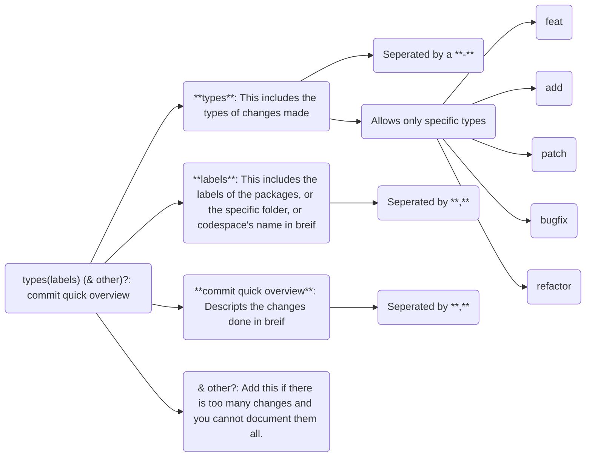

First of all, you must follow [the main contributing.md](https://github.com/Kryft-Studios/.github/CONTRIBUTING.md)

## Why this exists

Andromeda GPU aims to be a clean, fast, and developer-friendly abstraction over WebGPU.
This CONTRIBUTING guide ensures consistency, performance, and readability across the codebase.

## VSCode Extensions that might be helpful while contributing

- **WGSL Literal** by `ggsimm`
- **Path Intellisense** by `Christian Kohler`
- **Error Lens**
- **GLSL Literal**

## Coding Standards

- **Async First:** Most WebGPU calls are async. If you miss an `await`, the engine crashes. Check your promises!

### Example

```ts
await device.createRenderPipelineAsync; // <- async
```

> ## Do not use Prettier!
>
> We prefer VSCode's default `JavaScript and TypeScript Language Features` over Prettier.
> Prettier enforces opinionated formatting that can break manual alignment (e.g., matrices, buffers, and structured data).
> JTLF preserves developer formatting while applying minimal spacing corrections.

### Manual Formatting Standards

- **Buffer/Matrix Alignment:** When defining 4x4 matrices or large vertex arrays, keep them visually aligned (rows/columns) for readability.

## Casing Structure for AGPU

### Programming

| Name            | Case                                                                    |
| --------------- | ----------------------------------------------------------------------- |
| Types           | `UPPER_SNAKE_CASE`                                                      |
| Interfaces      | `UPPER_SNAKE_CASE`                                                      |
| Arguments       | `lowerCamelCase`                                                        |
| Classes         | `PascalCase`                                                            |
| Functions       | `lowerCamelCase`                                                        |
| Local Variables | `anyCase_YOUWant` (remain atleast 10% respective to readability please) |
| Variables       | `lowerCamelCase`                                                        |
| Namespaces      | `PascalCase`                                                            |
| Constants       | `UPPER_SNAKE_CASE`                                                      |
| Local Constants | `anyCase_YOUWant` (remain atleast 10% respective to readability please) |
| Private Fields  | `#lowerCamelCase`                                                       |
| Enums           | `PascalCase`                                                            |
| Enum Members    | `PascalCase`                                                            |
| Decorators      | `lowerCamelCase`                                                        |

#### Example

```ts
let THIS_IS_A_VARIABLE = ""; // this is a local variable and its name is FIRE 🔥🔥🔥

export default function helloWorld() {
  console.log("Hello World!");
} // This is a exported function. Therefore you must encounter eslint.

class Banana {
  // ...idk...
}
```

### Exceptions

#### If you are merging a interface or namespace with a class

- You are allowed to do `// eslint-disable-next-line` and then type the interface or namespace with the name of the class.

#### Unused variables are allowed but throw a warning.

### Files

| File Extension    | Case               |
| ----------------- | ------------------ |
| `.txt`            | `UPPER_SNAKE_CASE` |
| `.md`             | `UPPER_SNAKE_CASE` |
| `.js` and similar | `lowerCamelCase`   |
| `.ts` and similar | `lowerCamelCase`   |
| `.json`           | `lowerCamelCase`   |
| `.yaml`           | `lower-kebab-case` |
| `.gitignore`      | (none)             |
| `.npmignore` |(none)|

```ignore
# UPPER_SNAKE_CASE_FILES
THIS_IS_A_FILE.txt
THIS_IS_A_FILE.md

# lowerCamelCaseFiles
thisIsAFile.js
thisIsAFile.ts
thisIsAFile.json

# lower-kebab-case-files
this-is-a-file.yaml

# empty
.gitignore
```

### Folders

Folders follow `lower case`
Except if its a helper folder for a file. [Read more](#creating-helper-folders-for-a-file)

## Commit naming guide

A commit in this repository is made of two parts



### Example

<span style="color:cyan;font-weight:bold">refactor-add</span>(<span style="color:red;font-weight:bold">bindings,utils</span>): Add absolutely nothing

## Creating helper folders for a file

Whilst creating helper folders for a file, ensure that the folder's name is the exact file's name without the file exension.

### Example

```gitignore
# This is very important file
exist.js

# This is helper file
exist
| eatBanana.js
| doSomething.js
| iDontKnowWhyThereIsATsFileHere.js
```

# Creating a new package

To create a new package, you can use the package creation cli

```bash
cd packages
node pkg.js
```

It will prompt you with name, version, and whether to create the testing folder for the package in dev/ or not.

## Args

1. Name

This can either be prompted or passed directly in the command

**Question:** "Enter package name: "

Argument: `1`

#### Example

```ps1
node pkg.js something
```

2. Version

This can either be prompted or passed directly in the command

**Question:** "Enter package version: "

Argument: `2`

#### Example

```ps1
node pkg.js something 1.0.0
```

3. Dev

This can either be prompted or passed directly in the command
Unlike the version or name arguments, this is asked after the package is built.

**Question:** "Create a folder for this package in dev/? [y|n]"

Argument: `3`

#### Example

```ps1
node pkg.js something 1.0.0 y
```

## Avoid Class Explosion

Do not introduce new classes unless:
- it significantly reduces complexity for the user
- it cannot be solved with functions or composition

Prefer:
- functions
- internal modules
- data-driven patterns

Over:
- inheritance
- micro-classes