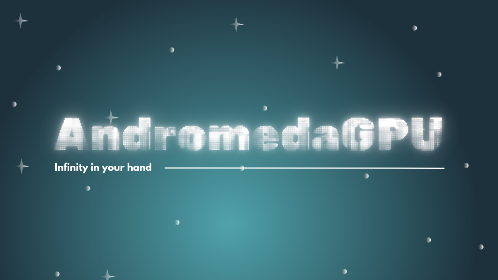

# AndromedaGPU

AndromedaGPU is a 3d library that's purely built with **WebGPU**

It aims to make graphics programming in web easier and faster.

# Check it out
- **Main Package**: [andromeda-gpu](/packages/main)
- **Utilities Package**: [@agpu/utils](/packages/utils/)
- **Bindings: Making WebGPU easier while keeping the concepts**: [@agpu/bindings](/packages//bindings)